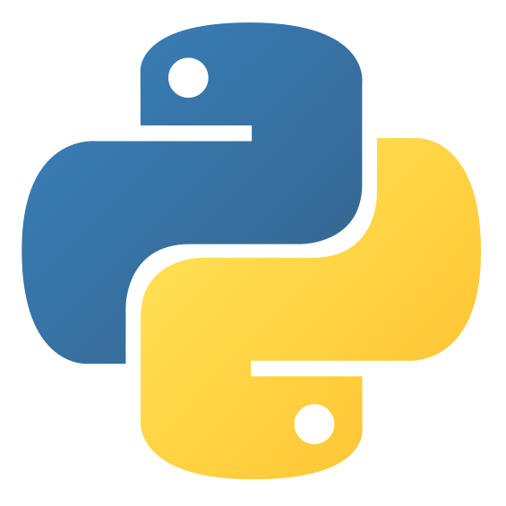
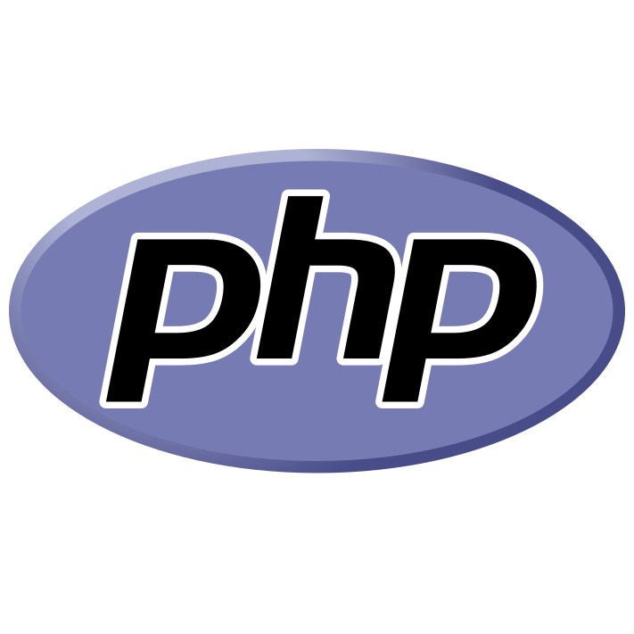
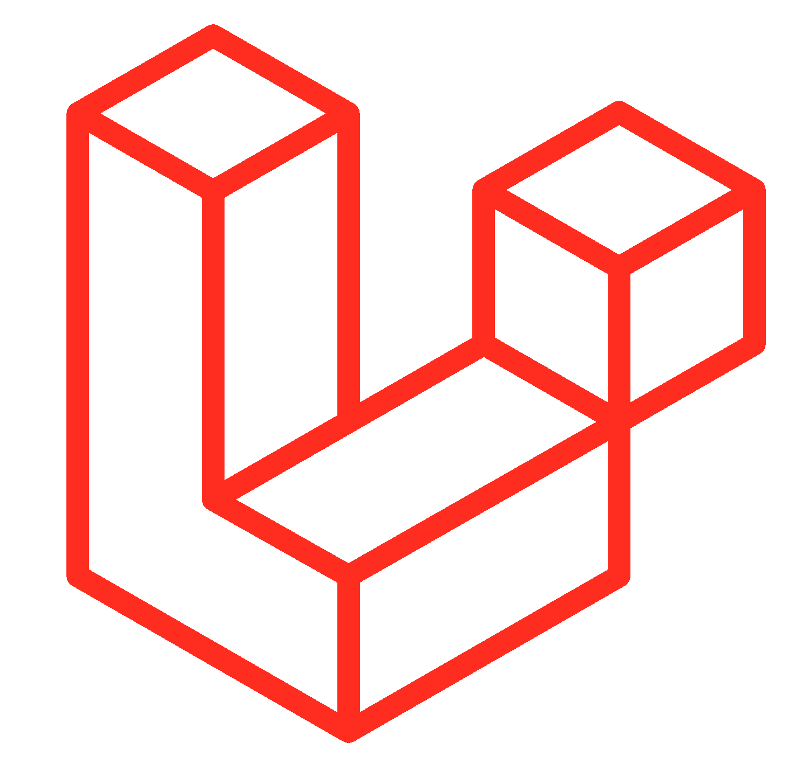
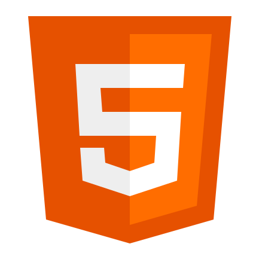
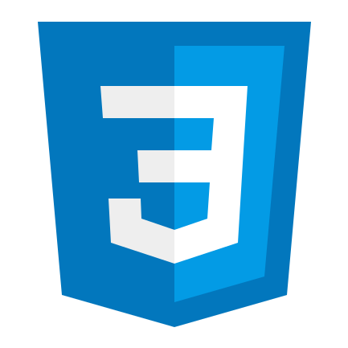
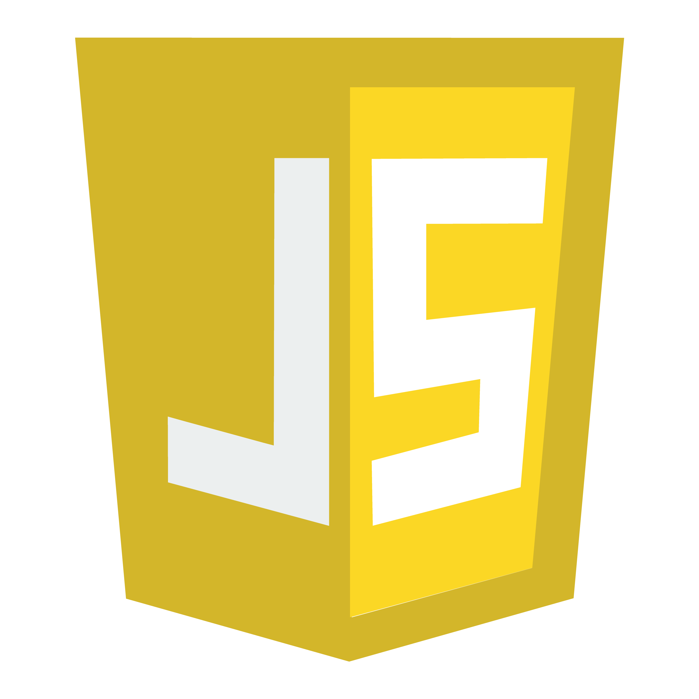
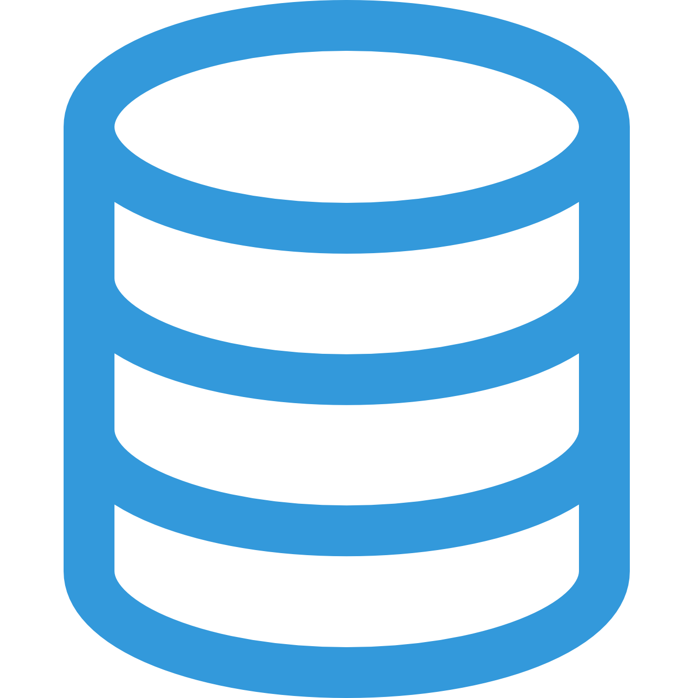
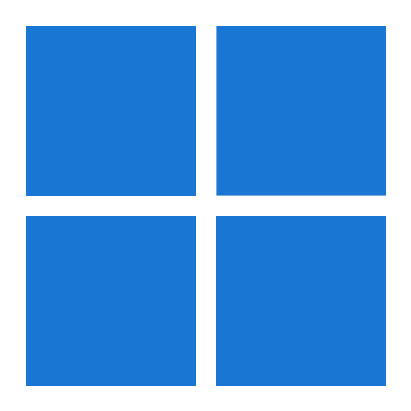
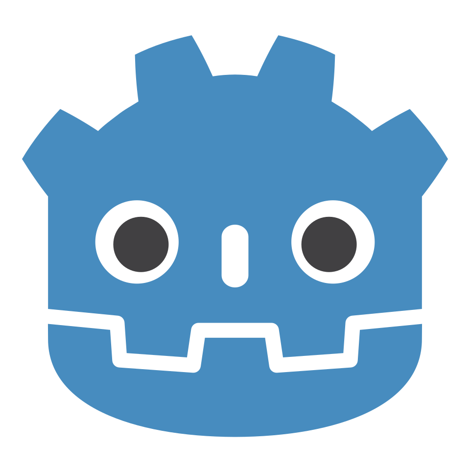
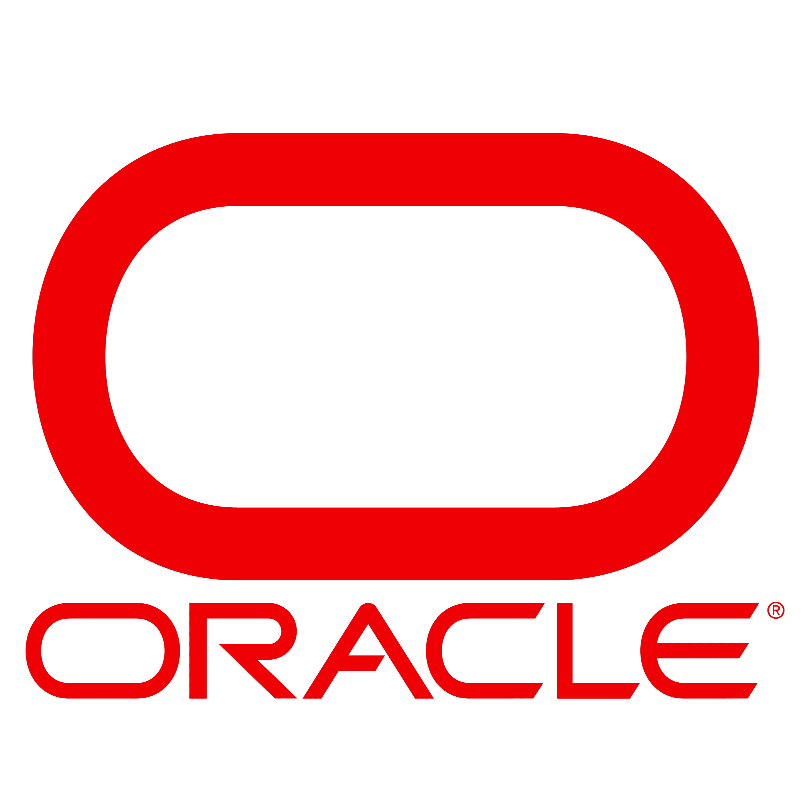

<h1 align="center">Josué MARTIN - Code, Systèmes & Projets 👨‍💻</h1>

---

  🎓 Étudiant en BUT Informatique, passionné par le développement logiciel et les systèmes informatiques.  
  💡 Curieux par nature, j’aime explorer de nouvelles technologies, tester des idées et donner vie à des projets concrets.  
  🌍 Toujours motivé à collaborer, partager mes connaissances et contribuer à des projets collectifs

---

<h2 align="center">🛠️ Compétences techniques</h2>

<h3 align="center">🌐 Langages & frameworks</h3>

  
  
  
  
  
  
  
  
  
  
  
  <!--  -->

<h3 align="center">🔧 Outils & Environnements</h3>

  
  
  
  
  
  
  
  
  
  
  

 

🔎 Ces compétences techniques représentent l’essentiel de mon parcours actuel. Je continue à élargir mes connaissances, explorer de nouveaux langages, frameworks et outils, et améliorer ma pratique à travers mes projets personnels et universitaires. 🔎

---

<h2 align="center">🎯 Mes Objectifs </h2>

  🌱 Continuer à apprendre et renforcer mes connaissances en développement et en systèmes informatiques.  
  🚀 Participer à des projets concrets, qu’ils soient académiques, personnels ou open-source.  
  🔐 Explorer davantage des domaines qui m’intéressent comme la cybersécurité et l’optimisation logicielle.  
  👥 Développer mes compétences en travail d’équipe et en gestion de projet.  

